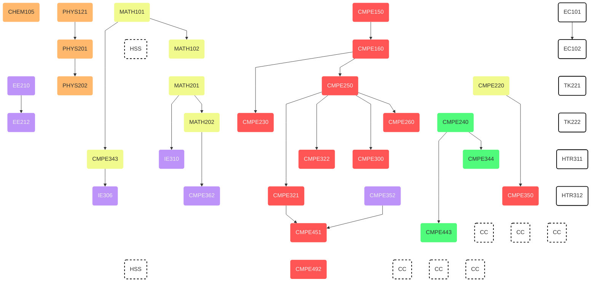

Computer engineering program consist of
,
,
,
,

## Course Plan

<!-- prettier-ignore-start -->

||
|:-- |:----------- |:-:|:---:|
| <h4>First Semester</h4>|
| **Code** |**Course Title** |**Credits**|**Notes**|
| MATH101 | Calculus I | 4 ||
| PHYS121 | Introductory Mechanics & Thermodynamics |4 ||
| CHEM105 | Fundamentals of Chemistry |4||
| [CMPE150](/undergraduate/courses/cmpe150) | Introducution to Computing |3||
| EC101 | Principles of Microeconomics |3||
||| 18 ||
| <h4>Second Semester</h4>|
| **Code** |**Course Title** |**Credits**|**Notes**|
| MATH102 | Calculus II | 4 ||
| PHYS201 | Physics III | 4 ||
| HSS | Humanities and Social Sciences (Elective)| 3-4 ||
| [CMPE160](/undergraduate/courses/cmpe160) | Introduction to Object Oriented Programming | 4 ||
| EC102 | Principles of Macroeconomics | 3 ||
||| 18-19 ||
| <h4>Third Semester</h4>|
| **Code** |**Course Title** |**Credits**|**Notes**|
| MATH201 | Matrix Theory | 4 ||
| PHYS202 | Physics IV | 4 ||
| EE210 | Introduction to Electrical Engineering | 3||
| [CMPE220](/undergraduate/courses/cmpe220) | Discrete Computational Structures | 3||
| [CMPE250](/undergraduate/courses/cmpe250) | Data Structures and Algorithms | 4||
| TK221 | Turkish for Native Speakers I | 2 | a |
||| 20 ||
| <h4>Fourth Semester</h4>|
| **Code** |**Course Title** |**Credits**|**Notes**|
| MATH202 | Differential Equations | 4 ||
| EE212 | Introduction to Electronic Engineering | 3 ||
| [CMPE230](/undergraduate/courses/cmpe230) | Systems Programming | 4 ||
| [CMPE240](/undergraduate/courses/cmpe240) | Digital Systems | 4 ||
| [CMPE260](/undergraduate/courses/cmpe260) | Principles of Programming Languages | 3 ||
| TK222 | Turkish for Native Speakers II | 2 | a |
||| 20 ||
| <h4>Fifth Semester</h4>|
| **Code** |**Course Title** |**Credits**|**Notes**|
| MATH202 | Differential Equations | 4 ||
| EE212 | Introduction to Electronic Engineering | 3 ||
| [CMPE230](/undergraduate/courses/cmpe230) | Systems Programming | 4 ||
| [CMPE240](/undergraduate/courses/cmpe240) | Digital Systems | 4 ||
| [CMPE260](/undergraduate/courses/cmpe260) | Principles of Programming Languages | 3 ||
| TK222 | Turkish for Native Speakers II | 2 ||
||| 20 ||
| <h4>Sixth Semester</h4>|
| **Code** |**Course Title** |**Credits**|**Notes**|
| [CMPE321](/undergraduate/courses/cmpe321) | Introduction to Database Systems | 4 ||
| [CMPE350](/undergraduate/courses/cmpe350) | Formal Languages and Automata Theory | 3 ||
| [CMPE352](/undergraduate/courses/cmpe352) | Fundamentals of Software Engineering | 2 ||
| [CMPE362](/undergraduate/courses/cmpe362) | Introduction to Signal Processing | 3 ||
| IE306 | Systems Simulation | 4 ||
| HTR312 | History of the Turkish Republic II | 2 ||
||| 18 ||
| <h4>Seventh Semester</h4>|
| **Code** |**Course Title** |**Credits**|**Notes**|
| [**CMPE443**](/undergraduate/courses/cmpe443) | Principles of Embedded Systems Design | 4 ||
| [**CMPE451**](/undergraduate/courses/cmpe451) | Project Development in Software Engineering | 2 ||
| CC | Complemetary Course (Elective) | 3-4 ||
| CC | Complemetary Course (Elective) | 3-4 ||
| CC | Complemetary Course (Elective) | 3-4 ||
||| 15-18 ||
| <h4>Eighth Semester</h4>|
| **Code** |**Course Title** |**Credits**|**Notes**|
| CMPE492 | Computer Engineering Design Project | 4 ||
| HSS | Humanities and Social Sciences (Elective) | 3-4 ||
| CC | Complemetary Course (Elective) | 3-4 ||
| CC | Complemetary Course (Elective) | 3-4 ||
| CC | Complemetary Course (Elective) | 3-4 ||

<!-- prettier-ignore-end -->

## Notes

<!-- prettier-ignore-start -->

||
|:-- |:----------- |:-:|:---:|
| a | |

<!-- prettier-ignore-end -->

## Committee


