<!-- prettier-ignore-start -->

||
|:-- |:----------- |:-:|:---:|
| <h4>First Semester</h4>|
| **Code** |**Course Title** | **Prerequisites** | **Credits** | **ECTS** |
| MATH101 | Calculus I | --- | 4 ||
| PHYS121 | Introductory Mechanics & Thermodynamics | --- | 4 ||
| CHEM105 | Fundamentals of Chemistry | --- | 4||
| [CMPE150](/courses/cmpe150) | Introducution to Computing | --- | 3||
| EC101 | Principles of Microeconomics | --- | 3||
|||| **18** ||
| <h4>Second Semester</h4>|
| **Code** |**Course Title** | **Prerequisites** | **Credits** | **ECTS** |
| MATH102 | Calculus II | MATH101 | 4 ||
| PHYS201 | Physics III | PHYS121 | 4 ||
| HSS | Humanities and Social Sciences (Elective)| --- |  3-4 ||
| [CMPE160](/courses/cmpe160) | Introduction to Object Oriented Programming | CMPE150 | 4 ||
| EC102 | Principles of Macroeconomics | EC101 |  3 ||
||||  **18-19** ||
| <h4>Third Semester</h4>|
| **Code** |**Course Title** | **Prerequisites** | **Credits** | **ECTS** |
| MATH201 | Matrix Theory | --- | 4 ||
| PHYS202 | Physics IV | PHYS201 | 4 ||
| EE210 | Introduction to Electrical Engineering | --- | 3||
| [CMPE220](/courses/cmpe220) | Discrete Computational Structures | --- | 3||
| [CMPE250](/courses/cmpe250) | Data Structures and Algorithms | CMPE160 | 4||
| TK221 | Turkish for Native Speakers I | --- | 2 ||
|||| **20** ||
| <h4>Fourth Semester</h4>|
| **Code** |**Course Title** | **Prerequisites** | **Credits** | **ECTS** |
| MATH202 | Differential Equations | MATH201 | 4 ||
| EE212 | Introduction to Electronic Engineering | EE210 | 3 ||
| [CMPE230](/courses/cmpe230) | Systems Programming | CMPE160 | 4 ||
| [CMPE240](/courses/cmpe240) | Digital Systems | --- | 4 ||
| [CMPE260](/courses/cmpe260) | Principles of Programming Languages | CMPE250 | 3 ||
| TK222 | Turkish for Native Speakers II || 2 ||
|||| **20** ||
| <h4>Fifth Semester</h4>|
| **Code** |**Course Title** | **Prerequisites** | **Credits** | **ECTS** |
| [CMPE300](/courses/cmpe300) | Analysis of Algorithms | CMPE250 | 3 ||
| [CMPE322](/courses/cmpe322) | Operating Systems | CMPE250 | 4 ||
| [CMPE343](/courses/cmpe343) | Introduction to Probability and Statistics for Computer Engineers | MATH101 | 3 ||
| [CMPE344](/courses/cmpe344) | Computer Organization | CMPE240 | 4 ||
| IE310 | Operations Research | MATH201 | 4 ||
| HTR311 | History of the Turkish Republic I  || 2 ||
|||| **20** ||
| <h4>Sixth Semester</h4>|
| **Code** |**Course Title** | **Prerequisites** | **Credits** | **ECTS** |
| [CMPE321](/courses/cmpe321) | Introduction to Database Systems | CMPE250 | 4 ||
| [CMPE350](/courses/cmpe350) | Formal Languages and Automata Theory | CMPE220 | 3 ||
| [CMPE352](/courses/cmpe352) | Fundamentals of Software Engineering | --- | 2 ||
| [CMPE362](/courses/cmpe362) | Introduction to Signal Processing for Computer Engineers | MATH202 | 3 ||
| IE306 | Systems Simulation | CMPE343 | 4 ||
| HTR312 | History of the Turkish Republic II || 2 ||
|||| **18** ||
| <h4>Seventh Semester</h4>|
| **Code** |**Course Title** | **Prerequisites** | **Credits** | **ECTS** |
| [CMPE443](/courses/cmpe443) | Principles of Embedded Systems Design | CMPE240 | 4 ||
| [CMPE451](/courses/cmpe451) | Project Development in Software Engineering | CMPE321, CMPE352 | 2 ||
| CC | Complemetary Course (Elective) || 3-4 ||
| CC | Complemetary Course (Elective) || 3-4 ||
| CC | Complemetary Course (Elective) || 3-4 ||
|||| **15-18** ||
| <h4>Eighth Semester</h4>|
| **Code** |**Course Title** | **Prerequisites** | **Credits** | **ECTS** |
| CMPE492 | Computer Engineering Design Project | SENIOR | 4 ||
| HSS | Humanities and Social Sciences (Elective) || 3 ||
| CC | Complemetary Course (Elective) || 3-4 ||
| CC | Complemetary Course (Elective) || 3-4 ||
| CC | Complemetary Course (Elective) || 3-4 ||
|||| **16-19** ||


<!-- prettier-ignore-end -->

## Course Prerequisites Graph

```mermaid "caption=prerequisites"
%%{ init: { 'flowchart': { 'curve': 'linear' } } }%%
flowchart TD

classDef core fill:#0072B2,stroke:none,stroke-width:2px,color:#eee,font-weight:bolder
classDef math fill:#F0E442,stroke:none,stroke-width:2px,color:#333,font-weight:bolder
classDef science fill:#D55E00,stroke:none,stroke-width:2px,color:#eee,font-weight:bolder
classDef general fill:#CC79A7,stroke:none,stroke-width:2px,color:#eee,font-weight:bolder
classDef elective fill:none,stroke:#000,stroke-width:3px,font-weight:bolder
classDef hardware fill:#009E73,stroke:none,stroke-width:2px, color:#eee,font-weight:bolder
classDef engineering fill:#56B4E9,stroke:none,stroke-width:2px, color:#eee,font-weight:bolder
classDef external fill:none,stroke:#000,stroke-width:3px,font-weight:bolder
classDef hidden display: none

EC101 --> EC102 ~~~ TK221 ~~~ TK222 ~~~ HTR311 ~~~ HTR312
PHYS121 --> PHYS201 --> PHYS202
CHEM105 ~~~~ EE210 --> EE212

MATH102 ~~~ CMPE220
MATH101 -----> CMPE343
MATH101 --> MATH102
MATH102 ~~~ MATH201
MATH201 --> MATH202

HARDWARE ~~~~~ CMPE240
CMPE240 --> CMPE344
CMPE240 ----> CMPE443

CMPE220 ----> CMPE350
CMPE350 ~~~ CC1 ~~~ CC4
CMPE350 ~~~ CC2 ~~~ CC5
CMPE350 ~~~ CC3 ~~~ CC6

CMPE150 --> CMPE160
CMPE160 ---> CMPE230
CMPE160 --> CMPE250
CMPE250 --> CMPE260
CMPE250 ---> CMPE300
CMPE250 ---> CMPE322
CMPE250 ----> CMPE321
CMPE352 --> CMPE451
CMPE321 --> CMPE451
CMPE451 ~~~ CMPE492

CMPE343 --> IE306

CMPE350 ~~~ CC1 ~~~ CC4
CMPE350 ~~~ CC2 ~~~ CC5
CMPE350 ~~~ CC3 ~~~ CC6

MATH201 ---> IE310
MATH202 ---> CMPE362

HSS0 ~~~ HSS1 ~~~~~~~~ HSS2


EC101("EC101"):::general
EC102("EC102"):::general
TK221("TK221"):::general
TK222("TK222"):::general
HTR311("HTR311"):::general
HTR312("HTR312"):::general

CHEM105("CHEM105"):::science
PHYS121("PHYS121"):::science
PHYS201("PHYS201"):::science
PHYS202("PHYS202"):::science

MATH101("MATH101"):::math
MATH102("MATH102"):::math
MATH201("MATH201"):::math
MATH202("MATH202"):::math

HSS0("HSS"):::hidden
HSS1("HSS"):::elective
HSS2("HSS"):::elective

IE306("IE306"):::engineering
IE310("IE310"):::engineering

ELECTRIC:::hidden
EE210("EE210"):::engineering
EE212("EE212"):::engineering

CMPE150("CMPE150"):::core
CMPE160("CMPE160"):::core

CMPE220("CMPE220"):::math
CMPE230("CMPE230"):::core
CMPE250("CMPE250"):::core
CMPE260("CMPE260"):::core

CMPE300("CMPE300"):::core
CMPE321("CMPE321"):::core
CMPE322("CMPE322"):::core
CMPE343("CMPE343"):::math

HARDWARE:::hidden
CMPE240("CMPE240"):::hardware
CMPE344("CMPE344"):::hardware
CMPE443("CMPE443"):::hardware


CMPE350("CMPE350"):::core
CMPE352("CMPE352"):::engineering
CMPE362("CMPE362"):::engineering

CMPE451("CMPE451"):::core
CMPE492("CMPE492"):::core



CC1("CC"):::elective
CC2("CC"):::elective
CC3("CC"):::elective
CC4("CC"):::elective
CC5("CC"):::elective
CC6("CC"):::elective

click CMPE150 href "/courses/cmpe150" "Course"
click CMPE160 href "/courses/cmpe160" "Course"
click CMPE220 href "/courses/cmpe220" "Course"
click CMPE230 href "/courses/cmpe230" "Course"
click CMPE240 href "/courses/cmpe240" "Course"
click CMPE250 href "/courses/cmpe250" "Course"
click CMPE260 href "/courses/cmpe260" "Course"
click CMPE300 href "/courses/cmpe300" "Course"
click CMPE321 href "/courses/cmpe321" "Course"
click CMPE322 href "/courses/cmpe322" "Course"
click CMPE343 href "/courses/cmpe343" "Course"
click CMPE344 href "/courses/cmpe344" "Course"
click CMPE350 href "/courses/cmpe350" "Course"
click CMPE352 href "/courses/cmpe352" "Course"
click CMPE362 href "/courses/cmpe362" "Course"
click CMPE443 href "/courses/cmpe443" "Course"
click CMPE451 href "/courses/cmpe451" "Course"
click CMPE492 href "/courses/cmpe492" "Course"

click CC1 href "/undergraduate/electives" "Undergraduate Electives"
click CC2 href "/undergraduate/electives" "Undergraduate Electives"
click CC3 href "/undergraduate/electives" "Undergraduate Electives"
click CC4 href "/undergraduate/electives" "Undergraduate Electives"
click CC5 href "/undergraduate/electives" "Undergraduate Electives"
click CC6 href "/undergraduate/electives" "Undergraduate Electives"

click HSS1 href "/undergraduate/electives" "Undergraduate Electives"
click HSS2 href "/undergraduate/electives" "Undergraduate Electives"
```

## Committee


