<!-- prettier-ignore-start -->

||
|:-- |:----------- |:-:|:---:|
| <h4>Birinci Dönem</h4>|
| **Ders Kodu** |**Ders Başlığı** | **Önkoşullar** | **Kredi** | **AKTS** |
| MATH101 | Analiz I | --- | 4 ||
| PHYS121 | Mekanik ve Termodinamiğe Giriş | --- | 4 ||
| CHEM105 | Kimyanın Temelleri | --- | 4||
| [CMPE150](/courses/cmpe150) | Bilgi İşleme Giriş | --- | 3||
| EC101 | Mikroekonominin İlkeleri | --- | 3||
|||| **18** ||
| <h4>İkinci Dönem</h4>|
| **Ders Kodu** |**Ders Başlığı** | **Önkoşullar** | **Kredi** | **AKTS** |
| MATH102 | Analiz II | MATH101 | 4 ||
| PHYS201 | Fizik III | PHYS121 | 4 ||
| HSS | Beşeri ve Sosyal Bilimler Dersi (Seçmeli)| --- |  3-4 ||
| [CMPE160](/courses/cmpe160) | Nesne Tabanlı Programlamaya Giriş | CMPE150 | 4 ||
| EC102 | Makroekonominin İlkeleri | EC101 |  3 ||
||||  **18-19** ||
| <h4>Üçüncü Dönem</h4>|
| **Ders Kodu** |**Ders Başlığı** | **Önkoşullar** | **Kredi** | **AKTS** |
| MATH201 | Matris Kuramı | --- | 4 ||
| PHYS202 | Fizik IV | PHYS201 | 4 ||
| EE210 | Elektrik Mühendisliğine Giriş | --- | 3||
| [CMPE220](/courses/cmpe220) | Kesikli Hesaplama Yapıları | --- | 3||
| [CMPE250](/courses/cmpe250) | Veri Yapıları ve Yordamlar | CMPE160 | 4||
| TK221 | Türkçe I | --- | 2 ||
|||| **20** ||
| <h4>Dördüncü Dönem</h4>|
| **Ders Kodu** |**Ders Başlığı** | **Önkoşullar** | **Kredi** | **AKTS** |
| MATH202 | Türevsel Denklemler | MATH201 | 4 ||
| EE212 | Elektronik Mühendisliğine Giriş | EE210 | 3 ||
| [CMPE230](/courses/cmpe230) | Sistem Programlama | CMPE160 | 4 ||
| [CMPE240](/courses/cmpe240) | Sayısal Sistemler | --- | 4 ||
| [CMPE260](/courses/cmpe260) | Programlama Dillerinin Prensipleri | CMPE250 | 3 ||
| TK222 | Türkçe II || 2 ||
|||| **20** ||
| <h4>Beşinci Dönem</h4>|
| **Ders Kodu** |**Ders Başlığı** | **Önkoşullar** | **Kredi** | **AKTS** |
| [CMPE300](/courses/cmpe300) | Algoritma Analizi | CMPE250 | 3 ||
| [CMPE322](/courses/cmpe322) | İşletim Sistemleri | CMPE250 | 4 ||
| [CMPE343](/courses/cmpe343) | Bilgisayar Mühendisleri için Olasılık ve İstatistiğe Giriş | MATH101 | 3 ||
| [CMPE344](/courses/cmpe344) | Bilgisayar Organizasyonu | CMPE240 | 4 ||
| IE310 | Yöneylem Araştırması | MATH201 | 4 ||
| HTR311 | Türkiye Cumhuriyeti Tarihi I  || 2 ||
|||| **20** ||
| <h4>Altıncı Dönem</h4>|
| **Ders Kodu** |**Ders Başlığı** | **Önkoşullar** | **Kredi** | **AKTS** |
| [CMPE321](/courses/cmpe321) | Veri Tabanı Sistemlerine Giriş | CMPE250 | 4 ||
| [CMPE350](/courses/cmpe350) | Biçimsel Diller ve Makineler Kuramı | CMPE220 | 3 ||
| [CMPE352](/courses/cmpe352) | Yazılım Mühendisliği Temelleri | --- | 2 ||
| [CMPE362](/courses/cmpe362) | Bilgisayar Mühendisleri için Sinyal İşlemeye Giriş | MATH202 | 3 ||
| IE306 | Sistem Benzetimi | CMPE343 | 4 ||
| HTR312 | Türkiye Cumhuriyeti Tarihi II || 2 ||
|||| **18** ||
| <h4>Yedinci Dönem</h4>|
| **Ders Kodu** |**Ders Başlığı** | **Önkoşullar** | **Kredi** | **AKTS** |
| [CMPE443](/courses/cmpe443) | Gömülü Sistem Tasarım Temelleri | CMPE240 | 4 ||
| [CMPE451](/courses/cmpe451) | Yazılım Mühendisliğinde Proje Tasarımı | CMPE321, CMPE352 | 2 ||
| CC | Tamamlayıcı Teknik Ders (Seçmeli) || 3-4 ||
| CC | Tamamlayıcı Teknik Ders (Seçmeli) || 3-4 ||
| CC | Tamamlayıcı Teknik Ders (Seçmeli) || 3-4 ||
|||| **15-18** ||
| <h4>Sekizinci Dönem</h4>|
| **Ders Kodu** |**Ders Başlığı** | **Önkoşullar** | **Kredi** | **AKTS** |
| CMPE492 | Bilgisayar Mühendisliği Tasarım Projesi | SENIOR | 4 ||
| HSS | Beşeri ve Sosyal Bilimler Dersi (Seçmeli) || 3 ||
| CC | Tamamlayıcı Teknik Ders (Seçmeli) || 3-4 ||
| CC | Tamamlayıcı Teknik Ders (Seçmeli) || 3-4 ||
| CC | Tamamlayıcı Teknik Ders (Seçmeli) || 3-4 ||
|||| **16-19** ||


<!-- prettier-ignore-end -->

## Ders Önkoşul Çizgesi

```mermaid "caption=prerequisites"
%%{ init: { 'flowchart': { 'curve': 'linear' } } }%%
flowchart TD

classDef core fill:#0072B2,stroke:none,stroke-width:2px,color:#eee,font-weight:bolder
classDef math fill:#F0E442,stroke:none,stroke-width:2px,color:#333,font-weight:bolder
classDef science fill:#D55E00,stroke:none,stroke-width:2px,color:#eee,font-weight:bolder
classDef general fill:#CC79A7,stroke:none,stroke-width:2px,color:#eee,font-weight:bolder
classDef elective fill:none,stroke:#000,stroke-width:3px,font-weight:bolder
classDef hardware fill:#009E73,stroke:none,stroke-width:2px, color:#eee,font-weight:bolder
classDef engineering fill:#56B4E9,stroke:none,stroke-width:2px, color:#eee,font-weight:bolder
classDef external fill:none,stroke:#000,stroke-width:3px,font-weight:bolder
classDef hidden display: none

EC101 --> EC102 ~~~ TK221 ~~~ TK222 ~~~ HTR311 ~~~ HTR312
PHYS121 --> PHYS201 --> PHYS202
CHEM105 ~~~~ EE210 --> EE212

MATH102 ~~~ CMPE220
MATH101 -----> CMPE343
MATH101 --> MATH102
MATH102 ~~~ MATH201
MATH201 --> MATH202

HARDWARE ~~~~~ CMPE240
CMPE240 --> CMPE344
CMPE240 ----> CMPE443

CMPE220 ----> CMPE350
CMPE350 ~~~ CC1 ~~~ CC4
CMPE350 ~~~ CC2 ~~~ CC5
CMPE350 ~~~ CC3 ~~~ CC6

CMPE150 --> CMPE160
CMPE160 ---> CMPE230
CMPE160 --> CMPE250
CMPE250 --> CMPE260
CMPE250 ---> CMPE300
CMPE250 ---> CMPE322
CMPE250 ----> CMPE321
CMPE352 --> CMPE451
CMPE321 --> CMPE451
CMPE451 ~~~ CMPE492

CMPE343 --> IE306

CMPE350 ~~~ CC1 ~~~ CC4
CMPE350 ~~~ CC2 ~~~ CC5
CMPE350 ~~~ CC3 ~~~ CC6

MATH201 ---> IE310
MATH202 ---> CMPE362

HSS0 ~~~ HSS1 ~~~~~~~~ HSS2


EC101("EC101"):::general
EC102("EC102"):::general
TK221("TK221"):::general
TK222("TK222"):::general
HTR311("HTR311"):::general
HTR312("HTR312"):::general

CHEM105("CHEM105"):::science
PHYS121("PHYS121"):::science
PHYS201("PHYS201"):::science
PHYS202("PHYS202"):::science

MATH101("MATH101"):::math
MATH102("MATH102"):::math
MATH201("MATH201"):::math
MATH202("MATH202"):::math

HSS0("HSS"):::hidden
HSS1("HSS"):::elective
HSS2("HSS"):::elective

IE306("IE306"):::engineering
IE310("IE310"):::engineering

ELECTRIC:::hidden
EE210("EE210"):::engineering
EE212("EE212"):::engineering

CMPE150("CMPE150"):::core
CMPE160("CMPE160"):::core

CMPE220("CMPE220"):::math
CMPE230("CMPE230"):::core
CMPE250("CMPE250"):::core
CMPE260("CMPE260"):::core

CMPE300("CMPE300"):::core
CMPE321("CMPE321"):::core
CMPE322("CMPE322"):::core
CMPE343("CMPE343"):::math

HARDWARE:::hidden
CMPE240("CMPE240"):::hardware
CMPE344("CMPE344"):::hardware
CMPE443("CMPE443"):::hardware


CMPE350("CMPE350"):::core
CMPE352("CMPE352"):::engineering
CMPE362("CMPE362"):::engineering

CMPE451("CMPE451"):::core
CMPE492("CMPE492"):::core

CC1("CC"):::elective
CC2("CC"):::elective
CC3("CC"):::elective
CC4("CC"):::elective
CC5("CC"):::elective
CC6("CC"):::elective

click CMPE150 href "/tr/courses/cmpe150" "Zorunlu Ders"
click CMPE160 href "/tr/courses/cmpe160" "Zorunlu Ders"
click CMPE220 href "/tr/courses/cmpe220" "Zorunlu Ders"
click CMPE230 href "/tr/courses/cmpe230" "Zorunlu Ders"
click CMPE240 href "/tr/courses/cmpe240" "Zorunlu Ders"
click CMPE250 href "/tr/courses/cmpe250" "Zorunlu Ders"
click CMPE260 href "/tr/courses/cmpe260" "Zorunlu Ders"
click CMPE300 href "/tr/courses/cmpe300" "Zorunlu Ders"
click CMPE321 href "/tr/courses/cmpe321" "Zorunlu Ders"
click CMPE322 href "/tr/courses/cmpe322" "Zorunlu Ders"
click CMPE343 href "/tr/courses/cmpe343" "Zorunlu Ders"
click CMPE344 href "/tr/courses/cmpe344" "Zorunlu Ders"
click CMPE350 href "/tr/courses/cmpe350" "Zorunlu Ders"
click CMPE352 href "/tr/courses/cmpe352" "Zorunlu Ders"
click CMPE362 href "/tr/courses/cmpe362" "Zorunlu Ders"
click CMPE443 href "/tr/courses/cmpe443" "Zorunlu Ders"
click CMPE451 href "/tr/courses/cmpe451" "Zorunlu Ders"
click CMPE492 href "/tr/courses/cmpe492" "Zorunlu Ders"

click CC1 href "/tr/undergraduate/electives" "Lisans Seçmelileri"
click CC2 href "/tr/undergraduate/electives" "Lisans Seçmelileri"
click CC3 href "/tr/undergraduate/electives" "Lisans Seçmelileri"
click CC4 href "/tr/undergraduate/electives" "Lisans Seçmelileri"
click CC5 href "/tr/undergraduate/electives" "Lisans Seçmelileri"
click CC6 href "/tr/undergraduate/electives" "Lisans Seçmelileri"

click HSS1 href "/tr/undergraduate/electives" "Lisans Seçmelileri"
click HSS2 href "/tr/undergraduate/electives" "Lisans Seçmelileri"
```

## Komisyon Üyeleri


